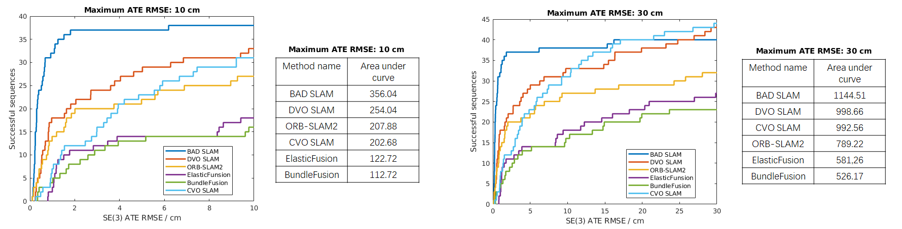

# CVO SLAM

CVO SLAM is a robust RGB-D SLAM system that performs well in scarcely textured and structured environments and shows comparable performance with the state-of-the-
art SLAM systems in various indoor domains. The following figure shows the cumulative error visualization plots and the area under curve of some state-of-the-art 
RGB-D SLAM systems and CVO SLAM on [ETH3D dataset](https://www.eth3d.net/slam_overview). The explaination of the plots and results of these state-of-the-art RGB-D 
SLAM systems could be found on [ETH3D SLAM benchmark](https://www.eth3d.net/slam_benchmark).



# 1. License
CVO SLAM is released under GNU GLPv3 license. It uses and/or modifies code from [CVO](https://github.com/MaaniGhaffari/cvo-rgbd), [DVO SLAM](https://github.com/tum-vision/dvo_slam) and [ORB-SLAM2](https://github.com/raulmur/ORB_SLAM2), which are all under GNU GLPv3 license. Besides, For the details about code changes we made, please refer to code_dependencies.md and corresponding code files. 

Besides, the code of [DBoW2](https://github.com/dorian3d/DBoW2) and [DLib](https://github.com/dorian3d/DLib) library that [ORB-SLAM2](https://github.com/raulmur/ORB_SLAM2) depends on are also used in our code, and we never modify them. All these code files are BSD licensed.  

# 2. Dependency
The code has been tested on ubuntu 16.04, further test on ubuntu 18.04 would be performed. C++ 11 compiler or a higher version is needed.

## Eigen3
Require the version to be at least 3.1.0, test with version 3.3.7, could be found [here](http://eigen.tuxfamily.org/index.php?title=Main_Page).

## OpenCV
Require the version to be at least 3.0.0, test with version 3.3.1, could be found [here](https://opencv.org/).

## PCL
Test with version 1.7 that comes with ubuntu 16.04.

## g2o 
Test with version 20170730, could be found [here](https://github.com/RainerKuemmerle/g2o/releases). Do not use a newer version due to API changes.

## ROS
Test code with ROS-kinetic. Need catkin to build package in code, so also make sure that catkin has been properly installed, detailed information about catkin is provided [here](http://wiki.ros.org/catkin).

## Intel Parallel Studio XE
Test with version 2019 Update 1, could found [here](https://software.intel.com/en-us/parallel-studio-xe). Intel C++ compiler and Intel TBB are required in installation.


# 3. Environment Setting

If you use ROS-kinetic, add the following source command to your ```.bashrc```

```
source /opt/ros/kinetic/setup.bash
```

After the installation of Intel Parallel Studio XE, add the following two source command to your ```.bashrc```, detailed instructions can be found [here](https://software.intel.com/en-us/articles/setting-up-the-build-environment-for-using-intel-c-or-fortran-compilers):

```
source opt/intel/mkl/bin/mklvars.sh intel64
source opt/intel/compilers_and_libraries/linux/bin/compilervars.sh intel64
``` 

# 4. Installation
Navigate to the root directory of the code, and execute the following command

```
catkin_make -j$(expr $(nproc) - 4) -DCMAKE_BUILD_TYPE=Release -DCMAKE_C_COMPILER=icc -DCMAKE_CXX_COMPILER=icpc
```

# 5. How to run
Current version of the code is only for reproducing results shown in the paper, and could be ran on [TUM dataset](https://vision.in.tum.de/data/datasets/rgbd-dataset/download) and the training sequences of [ETH3D dataset](https://www.eth3d.net/slam_overview). Further version with a better compatibility among more datasets would be released shortly.

After installation, navigate to the root directory of the code and execute

```
cd devel/lib/cvo_slam
./run_slam ../../../config/config.txt ../../../src/cvo_slam/thirdparty/ORB_SLAM2/vocabulary/ORBvoc.txt ../../../config/ORB_CONFIGURATION_FILE PATH_TO_SEQUENCE SEQUENCE_NUMBER ASSOCIATION_FILE_NAME
```

Please note that PATH_TO_SEQUENCE ends with "/". ASSOCIATION_FILE_NAME is name of the file that records the association between RGB and depth images. Details about association file could be found [here](https://vision.in.tum.de/data/datasets/rgbd-dataset/tools). Please note that the association file need to be placed under PATH_TO_SEQUENCE.

## TUM dataset
Use TUM1.yaml, TUM2.yaml and TUM3.yaml as ORB_CONFIGURATION_FILE for freiburg 1, freiburg 2, and freiburg 3 sequences respectively. SEQUENCE_NUMBER for freiburg 1, freiburg 2, and freiburg 3 is 1,2 and 3 repectively.

## Training sequences of ETH3D dataset
For sequence sfm_bench, sfm_garden, sfm_house_loop, sfm_lab_room_1, and sfm_lab_room_2, ORB_CONFIGURATION_FILE is ETH3D_training_2.yaml and SEQUENCE_NUMBER is 5.

For sequence sofa_1, sofa_2, sofa_3, sofa_4, and sofa_shake, ORB_CONFIGURATION_FILE is ETH3D_training_3.yaml and SEQUENCE_NUMBER is 6.

For other training sequences, ORB_CONFIGURATION_FILE is ETH3D_training_1.yaml and SEQUENCE_NUMBER is 4.