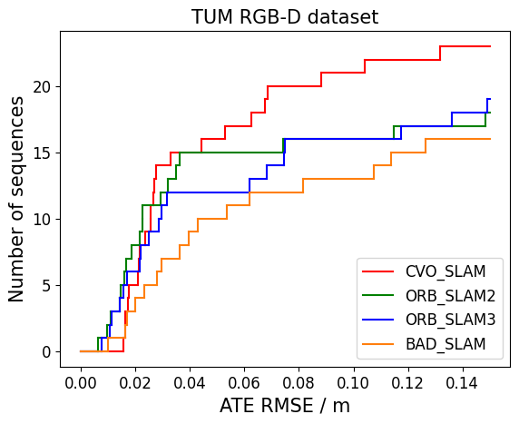
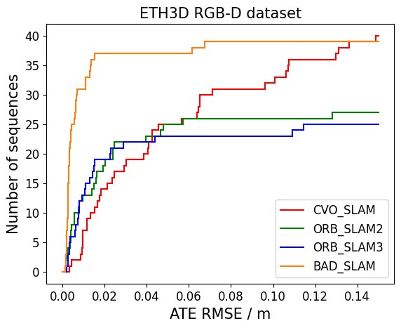

# CVO SLAM

CVO SLAM is a robust RGB-D SLAM system that works reliably in challenging scenarios such as rapid camera motion, texture-less environments, and overexposed images. Its performance has been evaluated on sequences from [TUM RGB-D dataset](https://vision.in.tum.de/data/datasets/rgbd-dataset/download) and [ETH3D RGB-D dataset](https://www.eth3d.net/slam_datasets), showing generally comparable performance to state-of-the-art systems.

<p align="center">
  

</p>

# 1. License
CVO SLAM is released under GNU GLPv3 license. It uses and/or modifies code from [CVO](https://github.com/MaaniGhaffari/cvo-rgbd), [DVO SLAM](https://github.com/tum-vision/dvo_slam) and [ORB-SLAM2](https://github.com/raulmur/ORB_SLAM2), which are all under GNU GLPv3 license. Besides, For the details about code changes we made, please refer to code_dependencies.md and corresponding code files. 

Besides, the code of [DBoW2](https://github.com/dorian3d/DBoW2) and [DLib](https://github.com/dorian3d/DLib) library that [ORB-SLAM2](https://github.com/raulmur/ORB_SLAM2) depends on are also used in our code, and we never modify them. All these code files are BSD licensed.  

# 2. Dependency
The code has been tested on ubuntu 16.04, further test on ubuntu 18.04 would be performed. C++ 11 compiler or a higher version is needed.

## Eigen3
Require the version to be at least 3.1.0, test with version 3.3.7, could be found [here](http://eigen.tuxfamily.org/index.php?title=Main_Page).

## OpenCV
Require the version to be at least 3.0.0, test with version 3.3.1, could be found [here](https://opencv.org/).

## g2o 
Test with version 20170730, could be found [here](https://github.com/RainerKuemmerle/g2o/releases). Do not use a newer version due to API changes.

## Intel® oneAPI DPC++/C++ Compiler
Could be found [here](https://www.intel.com/content/www/us/en/developer/tools/oneapi/dpc-compiler.html#gs.uxyut8). Intel C++ compiler is required in installation.


# 4. Installation
Navigate to the root directory of the code, and run the following commands
```
mkdir build
cd build
cmake .. -DCMAKE_C_COMPILER=icc -DCMAKE_CXX_COMPILER=icpc
make -j$(expr $(nproc) - 6)
```
Then extract the vocabulary file.
```
cd ../thirdparty/ORB_SLAM2/vocabulary
tar -xf ORBvoc.txt.tar.gz
``` 


# 5. How to run
We provide an executable to run sequences in TUM Dataset and ETH3D Dataset.

After installation, navigate to the root directory of the code and execute

```
cd build
./run_SLAM ../config/config.txt ../thirdparty/ORB_SLAM2/vocabulary/ORBvoc.txt ../config/ORB_CONFIGURATION_FILE PATH_TO_SEQUENCE ASSOCIATION_FILE_NAME 
```

Please note that PATH_TO_SEQUENCE ends with "/". ASSOCIATION_FILE_NAME is name of the file that records the association between RGB and depth images. Details about association file could be found [here](https://vision.in.tum.de/data/datasets/rgbd-dataset/tools). Please note that the association file need to be placed under PATH_TO_SEQUENCE.

## TUM RGB-D Dataset
Use TUM1.yaml, TUM2.yaml and TUM3.yaml as ORB_CONFIGURATION_FILE for freiburg 1, freiburg 2, and freiburg 3 sequences respectively.

## ETH3D RGB-D Dataset
For sequence sfm_bench, sfm_garden, sfm_house_loop, sfm_lab_room_1, and sfm_lab_room_2, use ETH3D_training_2.yaml as ORB_CONFIGURATION_FILE.

For sequence sofa_1, sofa_2, sofa_3, sofa_4, and sofa_shake, use ETH3D_training_3.yaml as ORB_CONFIGURATION_FILE.

For other training sequences, use ETH3D_training_1.yaml as ORB_CONFIGURATION_FILE.

For test sequences, you can copy ETH3D_training_1.yaml, adjust camera parameters, and use it as ORB_CONFIGURATION_FILE.


